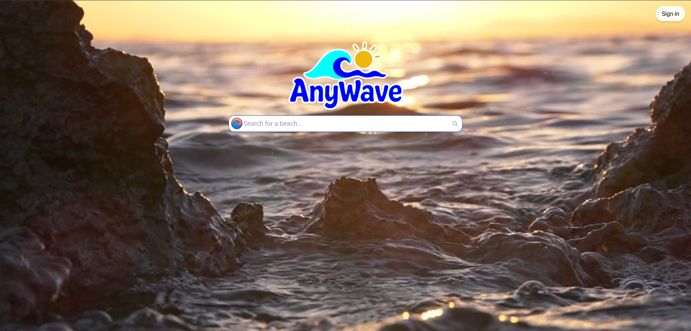
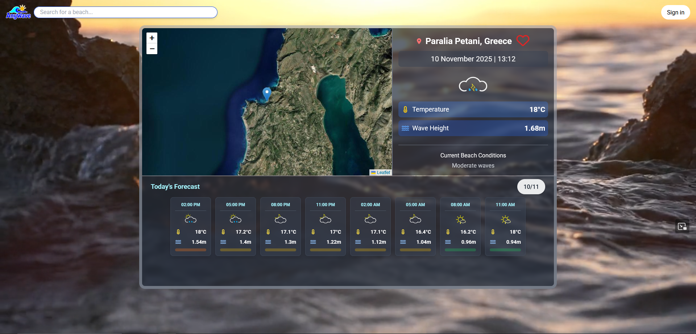
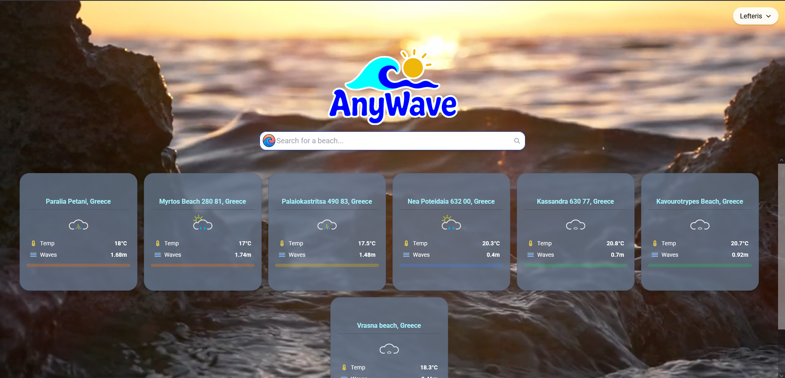

# 🌊 AnyWave

**AnyWave** is a responsive web application that provides real-time **weather** and **wave** data for beaches around the world.  
You can **search for beaches**, **view live conditions**, and **save your favorite spots** after logging in.

🔗 **Live Demo:** [AnyWave on GitHub Pages](https://lefteriskatsamagkas.github.io/AnyWave/)

---

## 📸 Screenshots

Home Page

Beach Details

Favorites
 
Log In


---

## 🌤️ Features

- 🔍 **Search Beaches** by name or location  
- 🌊 **View Real-Time Weather & Wave Data**  
- ❤️ **Save Favorite Beaches** after login  
- 📱 **Fully Responsive** (works on mobile, tablet, and desktop)  
- 🔐 **User Authentication** using Supabase  
- ☁️ **Deployed Frontend** on GitHub Pages and **Backend** on Render  

---

## 🧩 Tech Stack

### **Frontend**
- ⚛️ [React](https://reactjs.org/)
- 🎨 [Tailwind CSS](https://tailwindcss.com/)

### **Backend**
- 🟢 [Node.js](https://nodejs.org/) + [Express](https://expressjs.com/)
- 🐘 [PostgreSQL](https://www.postgresql.org/) via [Supabase](https://supabase.com/)
- 🌐 Hosted on [Render](https://render.com/)

---

## ⚙️ Installation & Setup

Follow these steps to run AnyWave locally:

### 1️⃣ Clone the repository
```bash
git clone https://github.com/lefteriskatsamagkas/AnyWave.git
cd AnyWave
```
### 2️⃣ Install dependencies
Frontend
```bash
cd client
npm install
```
Backend
```bash
cd server
npm install
```
### 3️⃣ Set up environment variables
Create a .env file in both the client and server directories.
For frontend (client/.env)
```bash
REACT_APP_API_URL=<your_backend_api_url>
REACT_APP_SUPABASE_URL=<your_supabase_url>
REACT_APP_SUPABASE_ANON_KEY=<your_supabase_anon_key>
```
For backend (server/.env)
```bash
GOOGLE_MAPS_API_KEY=<your_googleMaps_key>
SUPABASE_URL=<your_supabase_url>
SUPABASE_SERVICE_ROLE_KEY=<your_supabase_service_role_key>
```
### 4️⃣ Run the app locally
Start the backend
```bash
cd server
npm start
```
Start the frontend
```bash
cd client
npm start
```
Then visit http://localhost:3000

### 🚀 Deployment

- **Frontend:**
- **Backend:**
